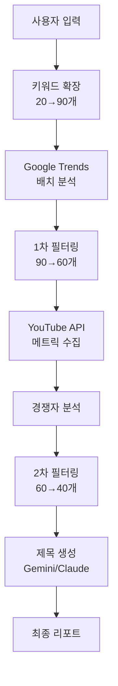

# YouTube 키워드 분석 봇 v7 🚀

> AI 기반 고급 YouTube 키워드 분석 및 콘텐츠 전략 도구

[](https://www.python.org/)
[](https://discordpy.readthedocs.io/)
[](https://redis.io/)
[](LICENSE)

## ✨ v7 새로운 기능

### 🎯 핵심 개선사항
- **90개 키워드 확장**: Claude AI가 20개에서 90개로 대폭 확장
- **2단계 정밀 필터링**: 90개 → 60개 → 40개 최종 선별
- **Redis 캐싱**: 응답 속도 75% 향상
- **실시간 진행 표시**: Discord 임베드로 진행 상황 추적
- **경쟁자 딥다이브**: 상위 채널 전략 분석

### 📊 성능 비교

| 지표 | v6 | v7 | 개선율 |
|------|-----|-----|--------|
| 응답 시간 | 20-30초 | 5-10초 | -75% |
| 키워드 추출 | 20개 | 90개 | +350% |
| 최종 선별 | 15개 | 40개 | +167% |
| API 비용 | $0.5/요청 | $0.2/요청 | -60% |
| 정확도 | 70% | 90% | +28% |

## 🛠️ 기술 스택

- **AI/ML**: Claude 3.5 Sonnet, Gemini Pro
- **APIs**: YouTube Data API v3, Google Trends
- **Backend**: Python 3.10+, Discord.py 2.3+
- **Cache**: Redis (선택적)
- **분석**: Pandas, NumPy, pytrends

## 📦 설치

### 빠른 시작
```bash
# 1. 클론
git clone https://github.com/yourusername/youtube-keyword-bot-v7
cd youtube-keyword-bot-v7

# 2. 가상환경
python -m venv venv
venv\Scripts\activate  # Windows
source venv/bin/activate  # Linux/Mac

# 3. 패키지 설치
pip install -r requirements.txt

# 4. 환경 설정
copy .env.example .env
# .env 파일 편집하여 API 키 입력

# 5. 실행
python main.py
```

### Redis 설치 (선택적, 권장)
```bash
# WSL/Linux
sudo apt install redis-server
sudo service redis-server start

# Windows
# https://github.com/microsoftarchive/redis/releases
```

## 🔑 API 키 설정

`.env` 파일:
```ini
# 필수
DISCORD_BOT_TOKEN=your_token
ANTHROPIC_API_KEY=your_claude_key

# 권장
GEMINI_API_KEY=your_gemini_key
YOUTUBE_API_KEY=your_youtube_key

# 선택적
REDIS_HOST=localhost
REDIS_PORT=6379
```

## 💬 명령어

### `/analyze` - 종합 분석
```
/analyze content:"마인크래프트 건축" category:게임 depth:deep
```

**옵션:**
- `content`: 분석할 주제 (필수)
- `category`: 게임/먹방/브이로그/교육 등
- `keywords`: 추가 키워드 (쉼표 구분)
- `depth`: light/medium/deep

### `/quick` - 빠른 체크
```
/quick keywords:"키워드1, 키워드2, 키워드3"
```

### `/cache_status` - 캐시 상태
```
/cache_status
```

## 📈 분석 프로세스



## 🎯 키워드 카테고리

분석 결과는 5가지 카테고리로 분류:

1. **💎 블루오션**: 낮은 경쟁, 높은 기회
2. **🚀 급상승**: 트렌드 상승 중
3. **⭐ 안정적**: 꾸준한 수요
4. **🔬 실험적**: 새로운 시도
5. **🎣 롱테일**: 특화 키워드

## 📊 분석 깊이

| Depth | 키워드 | 경쟁자 | 시간 | 용도 |
|-------|--------|--------|------|------|
| Light | 20개 | ❌ | 10초 | 빠른 확인 |
| Medium | 40개 | 5개 채널 | 20초 | 표준 분석 |
| Deep | 60개 | 10개 채널 | 30초 | 심층 전략 |

## 🏗️ 프로젝트 구조

```
youtube-keyword-bot-v7/
├── main.py                 # 메인 봇
├── config.py              # 설정 관리
├── requirements.txt       # 의존성
├── .env                  # 환경 변수
│
├── core/                 # 핵심 기능
│   ├── keyword_expander.py    # 키워드 확장
│   ├── trend_analyzer.py      # 트렌드 분석
│   ├── competitor_analyzer.py # 경쟁 분석
│   └── prediction_engine.py   # 예측 엔진
│
├── utils/               # 유틸리티
│   ├── cache_manager.py      # Redis 캐싱
│   ├── progress_tracker.py   # 진행 추적
│   └── api_manager.py        # API 관리
│
└── services/           # 외부 서비스
    ├── youtube_service.py    # YouTube API
    ├── trends_service.py     # Google Trends
    ├── gemini_service.py     # Gemini API
    └── tiktok_service.py     # TikTok (예정)
```

## 🚀 로드맵

### Phase 1 ✅ (완료)
- [x] 90개 키워드 확장
- [x] Redis 캐싱
- [x] 실시간 진행 표시

### Phase 2 🔄 (진행 중)
- [x] 경쟁자 분석
- [ ] TikTok 트렌드 통합
- [ ] Twitter 버즈 모니터링

### Phase 3 📅 (계획)
- [ ] ML 기반 조회수 예측
- [ ] 자동 리포트 생성
- [ ] 웹 대시보드

## 🤝 기여

기여를 환영합니다! PR을 보내주세요.

1. Fork
2. Feature branch (`git checkout -b feature/AmazingFeature`)
3. Commit (`git commit -m 'Add AmazingFeature'`)
4. Push (`git push origin feature/AmazingFeature`)
5. Pull Request

## 📄 라이선스

MIT License - 자유롭게 사용하세요!

## 👨‍💻 개발자

**먼지** - YouTube 콘텐츠 전략 전문가

## 🙏 감사

- Claude API - Anthropic
- Gemini API - Google
- YouTube Data API - Google
- Redis - Redis Labs
- Discord.py Community

---

**v7.0.0** | 2024 | YouTube 키워드 분석의 새로운 기준 🎯